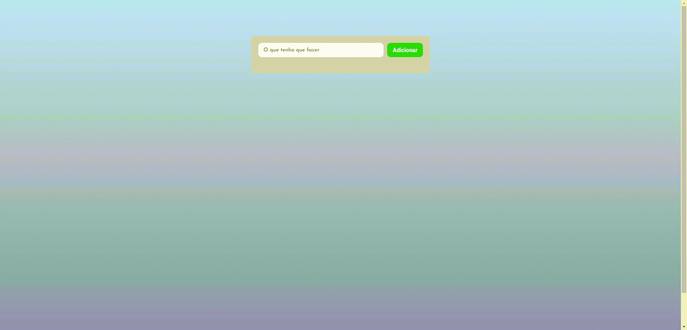

# To Do List

  <a href="#-tecnologias">Tecnologias</a>&nbsp;&nbsp;&nbsp;|&nbsp;&nbsp;&nbsp;
  <a href="#-projeto">Projeto</a>&nbsp;&nbsp;&nbsp;|&nbsp;&nbsp;&nbsp;
  <a href="#-contribuições">Contribuições</a>&nbsp;&nbsp;&nbsp;|&nbsp;&nbsp;&nbsp;

## 🎥 Demo
  O projeto está no ar e para acessá-lo basta [clicar aqui](https://todolistjs-alpha.vercel.app/).
  
  

     

## 🚀 Tecnologias

Esse projeto foi desenvolvido com as seguintes tecnologias:

- HTML e CSS
- JavaScript

## 💻 Projeto 
  To Do List, criado com HTML, CSS e JavaScript. Ele permite que você adicione tarefas, marque tarefas como concluídas e exclua tarefas. Este projeto também permite armazenar as tarefas no LocalStorage do navegador. Quando o usuário adiciona uma nova tarefa, ela é armazenada no LocalStorage e será exibida novamente quando o usuário abrir a página novamente. Isso significa que as tarefas não serão perdidas mesmo depois de fechar o navegador ou atualizar a página.
  
  ## 🤝 Contribuições

Este repositório é aberto à contribuições de toda a comunidade. Se você deseja contribuir para este projeto, por favor, siga as orientações abaixo:

1. Crie um fork deste repositório para sua própria conta.
2. Clone o repositório a partir do seu fork.
3. Crie uma branch para trabalhar nas suas alterações.
4. Faça as alterações necessárias no código.
5.Certifique-se de testar suas alterações antes de submeter um pull request.
6. Faça um commit e um push das suas alterações para o seu fork.
7. Submeta um pull request para o repositório principal, explicando as suas alterações de forma clara e detalhada.
8. Aguarde a revisão e aprovação do seu pull request.

## Licença 📝
Este projeto está licenciado sob a licença MIT. Para mais informações, consulte o arquivo [LICENSE](https://github.com/JoaoPedroOM/ToDoListJS/blob/main/LICENSE).
